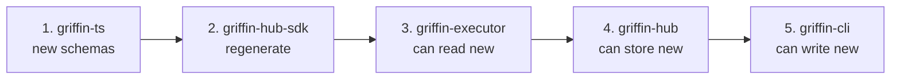

# Test Monitor Versioning Guide

This document outlines the process for making breaking changes to the test monitor schema while maintaining backward compatibility across all Griffin components.

## Overview

Griffin uses a **migrate-on-read** versioning strategy:
- Monitors are stored in their original version in the database
- Monitors are migrated to the latest version when loaded (if needed)
- All components can handle multiple monitor versions simultaneously
- Migration functions transform monitors between versions

## Architecture

The versioning system spans 5 packages:

1. **griffin-ts** - Single source of truth for schemas and migrations
2. **griffin-cli** - Validates and migrates DSL monitors before sending to hub
3. **griffin-hub** - Stores monitors in original version, migrates on read
4. **griffin-hub-sdk** - Auto-generated types from OpenAPI spec
5. **griffin-executor** - Migrates monitors to latest before execution

## Process: Making a Breaking Change

When you need to introduce a breaking schema change (e.g., adding a required field, removing a field, changing field types), follow these steps:

### Step 1: Define the New Schema Version

**File:** `griffin-ts/src/schema.ts`

1. Create a new version-specific DSL schema:
   ```typescript
   export const MonitorDSLSchemaV2 = Type.Object({
     locations: Type.Optional(Type.Array(Type.String())),
     name: Type.String(),
     version: Type.Literal("2.0"),  // New version
     frequency: FrequencySchema,
     nodes: Type.Array(NodeDSLSchema),
     edges: Type.Array(EdgeSchema),
     // Add new required fields here
     newRequiredField: Type.String(),
   });
   ```

2. Create a new version-specific resolved monitor schema:
   ```typescript
   export const ResolvedMonitorV2Schema = Type.Object({
     project: Type.String(),
     locations: Type.Optional(Type.Array(Type.String())),
     id: Type.Readonly(Type.String()),
     name: Type.String(),
     version: Type.Literal("2.0"),
     frequency: FrequencySchema,
     environment: Type.String({ default: "default" }),
     nodes: Type.Array(NodeResolvedSchema),
     edges: Type.Array(EdgeSchema),
     newRequiredField: Type.String(),
   });
   ```

3. Update the union schemas:
   ```typescript
   // Union of all supported DSL versions
   export const MonitorDSLSchema = Type.Union([MonitorDSLSchemaV1, MonitorDSLSchemaV2]);
   
   // Union of all supported resolved versions
   export const ResolvedMonitorSchema = Type.Union([ResolvedMonitorV1Schema, ResolvedMonitorV2Schema]);
   ```

4. Update type exports:
   ```typescript
   export type MonitorDSLV2 = Static<typeof MonitorDSLSchemaV2>;
   export type MonitorDSL = MonitorDSLV1 | MonitorDSLV2;
   
   export type ResolvedMonitorV2 = Static<typeof ResolvedMonitorV2Schema>;
   export type ResolvedMonitor = ResolvedMonitorV1 | ResolvedMonitorV2;
   ```

### Step 2: Write Migration Function

**File:** `griffin-ts/src/migrations.ts`

1. Create the migration function:
   ```typescript
   function migrateV1ToV2(monitor: ResolvedMonitorV1): ResolvedMonitorV2 {
     return {
       ...monitor,
       version: "2.0",
       // Set default values for new required fields
       newRequiredField: "default-value",
       // Transform existing fields if needed
       // existingField: transformField(monitor.existingField),
     };
   }
   ```

2. Register the migration:
   ```typescript
   const migrations: Record<string, MigrationFn<any, any>> = {
     "1.0->2.0": migrateV1ToV2,
     // Future: "2.0->3.0": migrateV2ToV3,
   };
   ```

3. Update the `VersionedMonitor` type in `griffin-hub/src/storage/monitor-mapper.ts`:
   ```typescript
   export type VersionedMonitor = MonitorV1 | MonitorV2;
   ```

4. Add the new case to the mapper switch:
   ```typescript
   switch (version) {
     case "1.0":
       return { ...publicFields, version: "1.0", ... } as MonitorV1;
     case "2.0":
       return { ...publicFields, version: "2.0", ... } as MonitorV2;
     default:
       throw new UnsupportedMonitorVersionError(version);
   }
   ```

### Step 3: Update Version Constants

**File:** `griffin-ts/src/schema.ts`

```typescript
export const CURRENT_MONITOR_VERSION = "2.0";  // Update to new version
export const SUPPORTED_MONITOR_VERSIONS = ["1.0", "2.0"] as const;  // Add new version
```

### Step 4: Update Hub Schemas

**File:** `griffin-hub/src/schemas/monitors.ts`

1. Import the new resolved monitor schema from griffin-ts
2. Update `MonitorV1Schema` to accept union of versions:
   ```typescript
   const MonitorVersionSchema = Type.Union([
     Type.Literal("1.0"),
     Type.Literal("2.0"),  // Add new version
   ]);
   ```

### Step 5: Regenerate OpenAPI Spec and SDK

**Commands:**

```bash
# In griffin-hub: regenerate OpenAPI spec from TypeBox schemas
cd griffin-hub
npm run generate:openapi

# In griffin-hub-sdk: regenerate TypeScript types from OpenAPI spec
cd griffin-hub-sdk
npm run build
```

### Step 6: Update Builders (if DSL changed)

**Files:** `griffin-ts/src/builder.ts`, `griffin-ts/src/sequential-builder.ts`

If the DSL schema changed, update the builders to set the new version:
```typescript
build(): MonitorDSL {
  return {
    ...this.monitor,
    version: CURRENT_MONITOR_VERSION,  // Will now be "2.0"
  };
}
```

### Step 7: Add Tests

**File:** `griffin-ts/src/migrations.test.ts`

Add tests for the new migration:
```typescript
describe("migrations", () => {
  it("migrates v1 monitor to v2", () => {
    const v1Monitor: ResolvedMonitorV1 = {
      project: "test",
      id: "test-id",
      name: "test-monitor",
      version: "1.0",
      frequency: { every: 1, unit: "MINUTE" },
      environment: "default",
      nodes: [],
      edges: [],
    };
    
    const v2Monitor = migrateMonitor<ResolvedMonitorV2>(v1Monitor, "2.0");
    expect(v2Monitor.version).toBe("2.0");
    expect(v2Monitor.newRequiredField).toBe("default-value");
    // Assert other transformations
  });
});
```

### Step 8: Deploy in Order

**Critical:** Deploy packages in this specific order to maintain backward compatibility:



**Why this order matters:**
- **griffin-ts** must be deployed first so other packages can import new types
- **griffin-hub-sdk** must be regenerated before executor/hub use new types
- **griffin-executor** must handle new format before hub starts storing it
- **griffin-hub** must accept new format before CLI starts sending it
- **griffin-cli** can be deployed last since it only writes new format

## Example: Adding a Required Field

Let's say you want to add a required `timeout` field to monitors:

### 1. Update Schema (`griffin-ts/src/schema.ts`)

```typescript
export const MonitorDSLSchemaV2 = Type.Object({
  // ... existing fields ...
  version: Type.Literal("2.0"),
  timeout: Type.Number(),  // New required field
});
```

### 2. Write Migration (`griffin-ts/src/migrations.ts`)

```typescript
function migrateV1ToV2(monitor: ResolvedMonitorV1): ResolvedMonitorV2 {
  return {
    ...monitor,
    version: "2.0",
    timeout: 30000,  // Default timeout: 30 seconds
  };
}
```

### 3. Update Builders (`griffin-ts/src/builder.ts`)

```typescript
export class TestBuilder {
  private monitor: Partial<MonitorDSL> = {
    timeout: 30000,  // Set default in builder
  };
  
  // ... rest of builder ...
}
```

## Testing Strategy

### Unit Tests
- Test migration function transforms correctly
- Test union schema validates both old and new formats
- Test executor handles both versions

### Integration Tests
- Create v1 monitor, store in hub, verify executor runs it
- Create v2 monitor, store in hub, verify executor runs it
- Test mixed-version scenarios during rolling deployment

## Rollback Strategy

If a new version has issues:

1. **Immediate:** Revert the deployment (packages can still read old versions)
2. **Data:** No migration needed - monitors stored in original version
3. **Code:** Revert version constants and remove migration function
4. **Deploy:** Deploy in reverse order (CLI → Hub → Executor → SDK → TS)

## Key Files Reference

| Package | Key Files | Purpose |
|---------|-----------|---------|
| griffin-ts | `src/schema.ts` | Schema definitions |
| griffin-ts | `src/migrations.ts` | Migration functions |
| griffin-hub | `src/storage/monitor-mapper.ts` | DB → API contract mapping |
| griffin-hub | `src/schemas/monitors.ts` | API contract schemas |
| griffin-hub | `src/routes/monitor/index.ts` | API endpoints |
| griffin-executor | `src/executor.ts` | Monitor execution |
| griffin-cli | `src/resolve.ts` | Monitor resolution |

## Common Patterns

### Adding Optional Field
- No migration needed (old monitors work fine)
- Just add field to new schema version
- Builders can set default value

### Adding Required Field
- Migration must provide default value
- Update builders to require/set the field
- Consider making it optional in v2, required in v3 for smoother transition

### Removing Field
- Migration should drop the field
- Update all code that references the field
- Consider deprecation period first

### Changing Field Type
- Migration must transform old type to new type
- Handle edge cases and invalid data gracefully
- Consider validation in migration

## Questions?

If you're unsure about a breaking change:
1. Check if it can be made non-breaking (additive changes)
2. Consider a deprecation period
3. Test migration with real monitor data
4. Review with team before deploying
